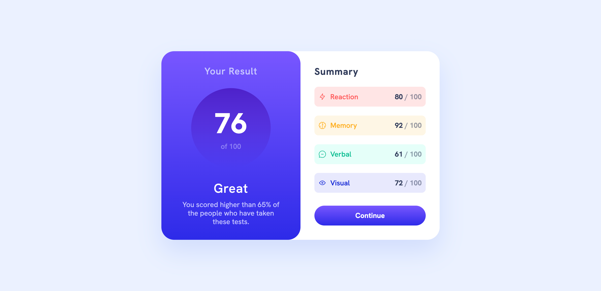
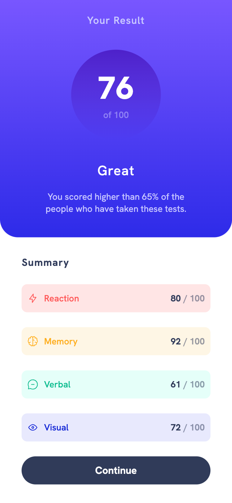

# Frontend Mentor - Results summary component solution

This is a solution to the [Results summary component challenge on Frontend Mentor](https://www.frontendmentor.io/challenges/results-summary-component-CE_K6s0maV). Frontend Mentor challenges help you improve your coding skills by building realistic projects.

## Table of contents

- [Overview](#overview)
  - [The challenge](#the-challenge)
  - [Screenshot](#screenshot)
  - [Links](#links)
- [My process](#my-process)
  - [Built with](#built-with)
  - [What I learned](#what-i-learned)
  - [Useful resources](#useful-resources)
- [Author](#author)

## Overview

### The challenge

Users should be able to:

- View the optimal layout for the interface depending on their device's screen size
- See hover and focus states for all interactive elements on the page

### Screenshot

### Links

- Solution URL: [Github](https://github.com/abucan/results-summary-app)
- Live Site URL: [Netlify](https://marvelous-praline-b89746.netlify.app/)

## My process

### Built with

- Semantic HTML5 markup
- CSS
- Flexbox
- CSS Grid
- [React](https://reactjs.org/) - JS library
- [Styled Components](https://styled-components.com/) - For styles

### What I learned

During this project which is my first ever on FrontendMentor I learned
to combine both CSS Grid for overall layout and stucture and Flexbox
for some inner components.

### Useful resources

- [CSS Grid](https://www.youtube.com/watch?v=0xMQfnTU6oo) - This helped me getting comfortable working with CSS Grid.
- [Flexbox](https://www.youtube.com/watch?v=3YW65K6LcIA&t=9s) - This helped me getting comfortable working with Flebox.

**Note: Delete this note and replace the list above with resources that helped you during the challenge. These could come in handy for anyone viewing your solution or for yourself when you look back on this project in the future.**

## Author

- Frontend Mentor - [@abucan](https://www.frontendmentor.io/profile/abucan)
